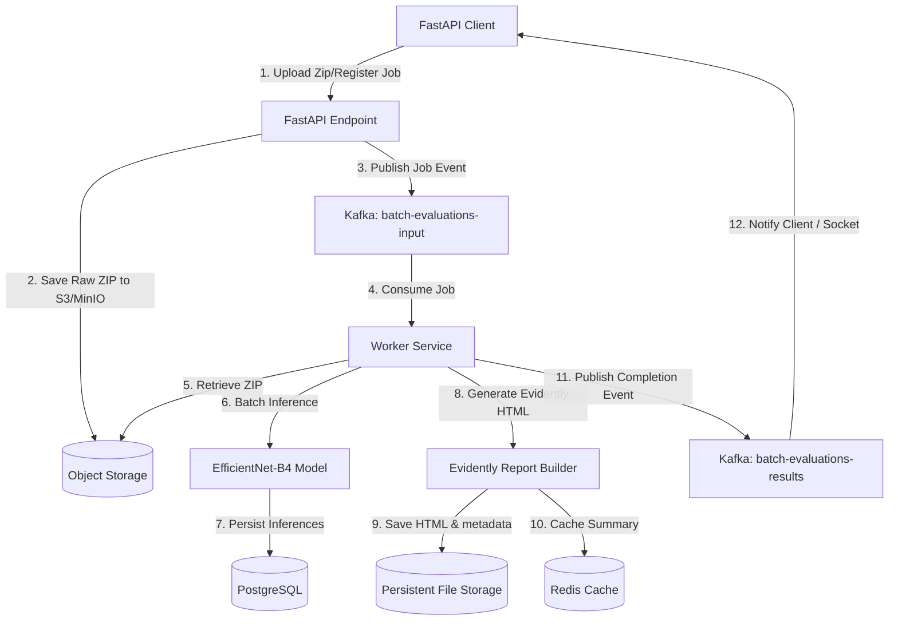

# Redis & Kafka Architecture Design: Scaling Batch Evaluation & Evidently Monitoring

This document details the production design for integrating **Redis** (for caching, rate-limiting, and locking) and **Kafka** (for asynchronous batch evaluation queue pipelines) in the **TruDrishti** platform.

---

## 1. Redis Caching & Storage Design

In production, batch evaluations containing thousands of images can be resource-intensive. Redis is used to cache processed JSON metrics, manage distributed execution locks, and prevent duplicate calculations.

### Cache Keys & Data Structures

| Key Pattern | Data Type | Value Schema / Description | TTL (Expiry) |
|:---|:---|:---|:---|
| `report:summary:{batch_id}` | String | Gzip-compressed JSON string of batch metrics summary (accuracy, precision, recall, f1, confusion matrix, drift alerts). | 30 Days (`2592000` s) |
| `report:status:{batch_id}` | String | Current status of async evaluation: `PENDING`, `PROCESSING`, `SUCCESS`, `FAILED`. | 24 Hours (`86400` s) |
| `lock:report:{batch_id}` | String | Distributed lock key (using Redlock algorithm) to ensure only one worker processes/generates a batch's report. | 10 Minutes (`600` s) |

### Distributed Lock Workflow (Redlock)
1. **Acquire Lock**: Prior to executing Evidently report generation, the worker tries to set `lock:report:{batch_id}` with a unique token and `NX` (Not Existing) and `PX 600000` (10-minute expiry).
2. **Execution**: If the lock is acquired, the worker processes the report.
3. **Release Lock**: Upon completion or error, the worker releases the lock using a Lua script that verifies the token matches, ensuring it only releases its own lock.

---

## 2. Kafka Asynchronous Queue Pipeline

To prevent HTTP timeouts when processing large ZIP archives (e.g. >100 images), evaluations are handled asynchronously via Kafka.

### Architecture Topology



### Kafka Topics Specifications

#### Topic: `batch-evaluations-input`
- **Partitions**: 6 (aligned with CPU/GPU worker scaling limits)
- **Replication Factor**: 3
- **Payload Schema (JSON)**:
  ```json
  {
    "job_id": "eval_8f9c211a-1102-4467-bc1a-55b89aef4190",
    "user_email": "admin@trudrishti.com",
    "zip_s3_path": "raw-batches/8f9c211a.zip",
    "has_csv": true,
    "csv_s3_path": "raw-batches/8f9c211a.csv",
    "timestamp": "2026-06-15T12:00:00Z"
  }
  ```

#### Topic: `batch-evaluations-results`
- **Partitions**: 3
- **Replication Factor**: 3
- **Payload Schema (JSON)**:
  ```json
  {
    "job_id": "eval_8f9c211a-1102-4467-bc1a-55b89aef4190",
    "status": "SUCCESS",
    "report_path": "reports/batch_eval_8f9c211a-1102-4467-bc1a-55b89aef4190.html",
    "metrics": {
      "accuracy": 91.43,
      "precision": 92.91,
      "recall": 92.91,
      "f1_score": 92.91
    },
    "error_message": null
  }
  ```

---

## 3. File Storage Design

HTML reports generated by Evidently AI are written to disk under a `reports/` folder.

1. **Local Disk (FastAPI Mount)**:
   - Path: `/app/reports/batch_{batch_id}.html`
   - Mounted via a Kubernetes **PersistentVolumeClaim (PVC)** using ReadWriteMany (RWX) access mode (like NFS or CephFS) to ensure all scaled replicas share the same directory structure.
2. **Object Storage Synchronization (S3 / GCS)**:
   - For high availability across cloud regions, a post-write hook uploads the generated HTML files to a secure private bucket `s3://trudrishti-eval-reports/reports/batch_{batch_id}.html`.
   - The API routers first check the local persistent volume mount, falling back to streaming from the object store if a local cache miss occurs.
